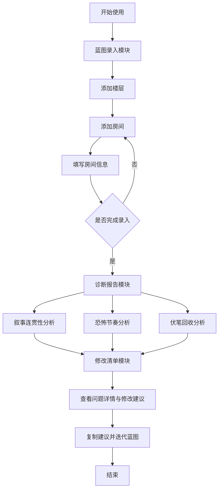

## 1. 产品概述

AI 智能鬼屋空间蓝图助手是一款面向叙事导演和恐怖体验设计师的专业评审工具，帮助团队在鬼屋项目评审前快速发现叙事漏洞、节奏问题和伏笔遗漏。通过结构化录入楼层与房间信息，系统自动生成叙事连贯性诊断、恐怖节奏建议和伏笔回收清单三大维度的专业评审报告。

- **目标用户**：鬼屋叙事导演、体验设计师、沉浸式娱乐创作团队
- **核心价值**：将空间叙事评审标准化、自动化，避免人工评审遗漏关键问题

## 2. 核心功能

### 2.1 用户角色

| 角色 | 注册方式 | 核心权限 |
|------|----------|----------|
| 叙事导演 | 无需注册，本地使用 | 录入蓝图、生成诊断、查看报告、导出修改清单 |

### 2.2 功能模块

1. **蓝图录入模块**：楼层管理、房间编辑、房间信息录入（房名、主要事件、可见物件、心理状态、空间类型）
2. **诊断报告模块**：空间叙事连贯性分析、恐怖节奏曲线分析、伏笔回收清单
3. **修改清单模块**：问题分类汇总、优先级排序、修改建议详情、一键复制

### 2.3 页面详情

| 页面名称 | 模块名称 | 功能描述 |
|----------|----------|----------|
| 主应用页 | 侧边导航 | 模块切换（蓝图录入/诊断报告/修改清单） |
| 主应用页 | 蓝图录入 | 楼层列表管理、房间卡片编辑、房间详情表单 |
| 主应用页 | 诊断报告 | 叙事连贯性分析卡片、恐怖节奏曲线图、伏笔回收表格 |
| 主应用页 | 修改清单 | 问题列表、分类筛选、优先级标签、一键复制功能 |

## 3. 核心流程

用户进入应用后，首先在蓝图录入模块创建楼层结构并填写每个房间的详细信息（房名、主要事件、玩家可见物件、心理状态、空间类型）。填写完成后切换到诊断报告模块，系统自动分析并输出三类诊断结果。用户可进一步在修改清单模块查看按优先级和分类整理的问题列表，复制建议后进行项目迭代。

## 4. 用户界面设计

### 4.1 设计风格

- **主色调**：深炭灰 `#1a1a1f` 作为背景，暗红 `#8b2635` 作为强调色，暗金 `#c9a962` 作为专业评审标识色
- **辅助色**：各类心理状态对应不同色彩标签（不安：靛蓝、怀疑：灰紫、压迫：暗红、释然：苔绿）
- **字体**：采用等宽衬线字体做标题（专业评审感），现代无衬线字体做正文
- **按钮风格**：直角或微圆角，带细边框，悬停时显示暗红内发光效果
- **布局风格**：三栏式布局（左侧导航、中间主内容、右侧详情面板）
- **图标风格**：线条简洁的线性图标，统一使用 1.5px 线宽

### 4.2 页面设计概览

| 页面名称 | 模块名称 | UI 元素 |
|----------|----------|----------|
| 主应用页 | 侧边导航 | 深色背景、暗金文字、图标+文字组合、选中项暗红高亮 |
| 主应用页 | 蓝图录入 | 楼层折叠面板、房间卡片网格、拖拽排序、表单弹窗 |
| 主应用页 | 诊断报告 | 分区卡片布局、数据可视化图表、问题标签系统、专业评审语气文本 |
| 主应用页 | 修改清单 | 表格视图、优先级徽章、分类筛选器、操作按钮 |

### 4.3 响应式设计

- 桌面端优先（≥1280px），三栏布局完整展示
- 平板端（768-1279px）：右侧详情面板改为底部抽屉
- 移动端（<768px）：单栏布局，底部 Tab 切换模块

### 4.4 视觉细节

- 全局加入微妙噪点纹理，营造胶片/老档案质感
- 诊断报告卡片边缘加入红色警告光效
- 伏笔回收项使用连线动画展示前后呼应关系
- 恐怖节奏曲线使用 SVG 绘制，带渐变填充和数据点高亮
