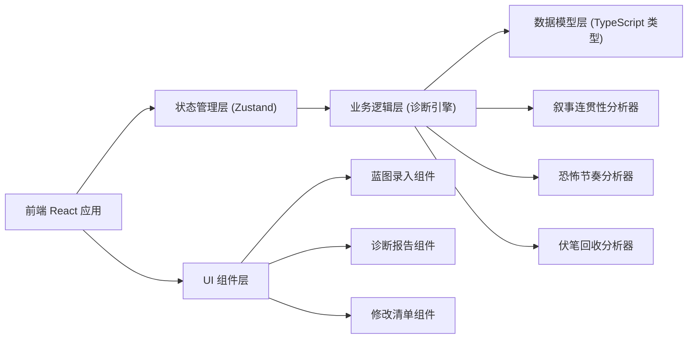
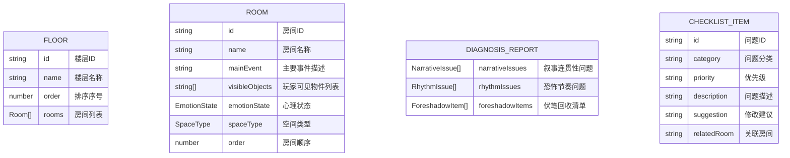

## 1. 架构设计



## 2. 技术描述

- **前端**：React@18 + TypeScript + Vite
- **样式**：TailwindCSS@3
- **状态管理**：Zustand
- **路由**：React Router DOM
- **图标**：Lucide React
- **后端**：无（纯前端应用，数据本地存储）
- **数据持久化**：localStorage

## 3. 路由定义

| 路由 | 用途 |
|------|------|
| / | 默认重定向到蓝图录入页 |
| /blueprint | 蓝图录入模块 |
| /diagnosis | 诊断报告模块 |
| /checklist | 修改清单模块 |

## 4. 数据模型

### 4.1 数据模型定义



### 4.2 TypeScript 类型定义

```typescript
type EmotionState = 'unease' | 'doubt' | 'oppression' | 'relief';
type SpaceType = 'narrow' | 'normal' | 'wide' | 'corridor' | 'staircase';
type Priority = 'critical' | 'high' | 'medium' | 'low';
type IssueCategory = 'narrative' | 'rhythm' | 'foreshadow';

interface Room {
  id: string;
  name: string;
  mainEvent: string;
  visibleObjects: string[];
  emotionState: EmotionState;
  spaceType: SpaceType;
  order: number;
}

interface Floor {
  id: string;
  name: string;
  order: number;
  rooms: Room[];
}

interface NarrativeIssue {
  id: string;
  fromRoom: string;
  toRoom: string;
  description: string;
  suggestion: string;
  missingEvidence: string[];
}

interface RhythmIssue {
  id: string;
  rooms: string[];
  description: string;
  suggestion: string;
  rhythmPattern: string;
}

interface ForeshadowItem {
  id: string;
  element: string;
  introducedIn: string;
  resolvedIn: string | null;
  status: 'resolved' | 'unresolved' | 'partial';
  description: string;
}

interface ChecklistItem {
  id: string;
  category: IssueCategory;
  priority: Priority;
  description: string;
  suggestion: string;
  relatedRoom: string;
}

interface BlueprintStore {
  floors: Floor[];
  addFloor: (name: string) => void;
  removeFloor: (id: string) => void;
  addRoom: (floorId: string, room: Omit<Room, 'id'>) => void;
  updateRoom: (floorId: string, roomId: string, updates: Partial<Room>) => void;
  removeRoom: (floorId: string, roomId: string) => void;
  reorderRooms: (floorId: string, roomIds: string[]) => void;
  getDiagnosisReport: () => {
    narrativeIssues: NarrativeIssue[];
    rhythmIssues: RhythmIssue[];
    foreshadowItems: ForeshadowItem[];
  };
  getChecklist: () => ChecklistItem[];
}
```

## 5. 核心诊断逻辑

### 5.1 叙事连贯性分析器
- 检测相邻房间之间的心理状态跳跃幅度过大
- 分析物件是否在前后房间有逻辑联系
- 检查事件叙事链条是否存在断层
- 识别从关键叙事节点直接跳转到结局的情况

### 5.2 恐怖节奏分析器
- 追踪空间类型序列（狭窄/开阔交替）
- 分析心理状态变化曲线（情绪起伏）
- 检测同类恐怖元素连续堆砌导致的疲劳
- 识别节奏过密或过疏的区段

### 5.3 伏笔回收分析器
- 从所有房间的"可见物件"和"主要事件"中提取伏笔元素
- 追踪每个伏笔元素是否在后续房间得到解释或呼应
- 标记完全未回收、部分回收、已回收三种状态
